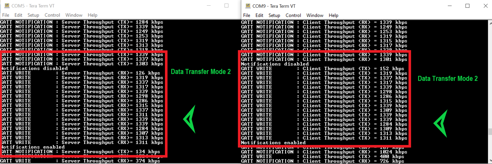
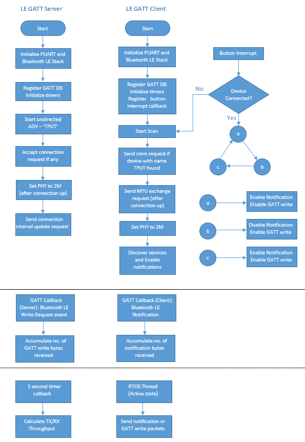

# AIROC&trade; CYW20xxx Bluetooth&reg; devices: Bluetooth&reg; LE throughput

This code example demonstrates the maximum Bluetooth&reg; LE throughput (using GATT layer notifications and write command) that can be obtained with Infineon AIROC&trade; CYW20xxx Bluetooth&reg; devices.

This code example has two applications:

1. **Bluetooth&reg; LE GATT Server throughput:** This application sends GATT notifications and calculates the Bluetooth&reg; LE Tx throughput, and receives GATT write command and calculates the Bluetooth&reg; LE Rx throughput.
2. **Bluetooth&reg; LE GATT Client throughput:** This application sends GATT write command and calculates the Bluetooth&reg; LE Tx throughput, and receives GATT notifications and calculates the Bluetooth&reg; LE Rx throughput.

**Note:** This code example can also be used with PSoC&trade; 6 Bluetooth&reg; LE kits programmed with the [PSoC&trade; 6 MCU Bluetooth&reg; LE throughput code example](https://github.com/Infineon/mtb-example-psoc6-ble-throughput-freertos). The PSoC&trade; 6 Bluetooth&reg; LE throughput code example is similar to this code example. It has two apps: one for GATT Server and another for GATT Client.

[View this README on GitHub.](https://github.com/Infineon/mtb-example-btsdk-ble-throughput)

[Provide feedback on this code example.](https://cypress.co1.qualtrics.com/jfe/form/SV_1NTns53sK2yiljn?Q_EED=eyJVbmlxdWUgRG9jIElkIjoiQ0UyMjYzMDEiLCJTcGVjIE51bWJlciI6IjAwMi0yNjMwMSIsIkRvYyBUaXRsZSI6IkFJUk9DJnRyYWRlOyBDWVcyMHh4eCBCbHVldG9vdGgmcmVnOyBkZXZpY2VzOiBCbHVldG9vdGgmcmVnOyBMRSB0aHJvdWdocHV0IiwicmlkIjoibmhlZyIsIkRvYyB2ZXJzaW9uIjoiMi4xLjAiLCJEb2MgTGFuZ3VhZ2UiOiJFbmdsaXNoIiwiRG9jIERpdmlzaW9uIjoiTUNEIiwiRG9jIEJVIjoiSUNXIiwiRG9jIEZhbWlseSI6IkJUQUJMRSJ9)

## Requirements

- [ModusToolbox&trade; software](https://www.cypress.com/products/modustoolbox-software-environment) v2.4

- Board support package (BSP) minimum required version: 3.3.0
- Programming language: C

- Associated parts:  [AIROC™ CYW20819 Bluetooth® & Bluetooth® LE system-on-chip](https://www.cypress.com/datasheet/CYW20819), [AIROC™ CYW20719 Bluetooth® & Bluetooth® LE system-on-chip](https://www.cypress.com/documentation/datasheets/cyw20719-enhanced-low-power-bredrble-bluetooth-50-soc), [AIROC™ CYW20735 Bluetooth® & Bluetooth® LE system-on-chip](https://www.cypress.com/documentation/datasheets/cyw20735b1-single-chip-bluetooth-transceiver-wireless-input-devices), [AIROC™ CYW20820 Bluetooth® & Bluetooth® LE system-on-chip](https://www.infineon.com/dgdl/Infineon-CYW20820_Ultra_Low_Power_Bluetooth_LE_BR_EDR_Bluetooth_5.0_SoC-AdditionalTechnicalInformation-v06_00-EN.pdf?fileId=8ac78c8c7d0d8da4017d0ee7e70770d1&utm_source=cypress&utm_medium=referral&utm_campaign=202110_globe_en_all_integration-datasheet)


## Supported toolchains (make variable 'TOOLCHAIN')

- GNU Arm® embedded compiler v9.3.1 (`GCC_ARM`) - Default value of `TOOLCHAIN`

## Supported kits (make variable 'TARGET')

- [CYW920820M2EVB-01 evaluation kit](https://www.infineon.com/cms/en/product/wireless-connectivity/airoc-bluetooth-le-bluetooth-multiprotocol/cyw20820/)(`CYW920820M2EVB-01`)- Default value of `TARGET`
- [CYW920719B2Q40EVB-01 evaluation kit](https://www.cypress.com/documentation/development-kitsboards/cyw920719b2q40evb-01-evaluation-kit) (`CYW920719B2Q40EVB-01`)
- [CYW920735Q60EVB-01 evaluation kit](https://www.cypress.com/CYW920735Q60EVB-01) (`CYW920735Q60EVB-01`)
- [CYW920819EVB-02 evaluation kit](https://www.cypress.com/CYW920819EVB-02) (`CYW920819EVB-02`)
- [CYW920820EVB-02 evaluation kit](https://www.cypress.com/CYW920820EVB-02) (`CYW920820EVB-02`)

## Hardware setup

This example uses the board's default configuration. See the kit user guide to ensure that the board is configured correctly.

Two boards are required to use this code example: one for Bluetooth&reg; LE GATT Server throughput and the other for Bluetooth&reg; LE GATT Client throughput.

Any combination of the kits mentioned in [supported kits](#Supported-kits-(make-variable-'TARGET')) can be used. For example, CYW920819EVB-02 can be used as a GATT Server with CYW920719B2Q40EVB-01 as GATT Client. PSoC&trade; 6 Bluetooth&reg; LE kits programmed with the [PSoC&trade; 6 Bluetooth&reg; LE throughput code example](https://github.com/Infineon/mtb-example-psoc6-ble-throughput-freertos) can also be used.


## Software setup

Install a terminal emulator if you don't have one. Instructions in this document use [Tera Term](https://ttssh2.osdn.jp/index.html.en).

To use a Windows PC as the Bluetooth&reg; LE Central device for the GATT Server throughput application, install [CySmart host emulation tool](https://www.cypress.com/documentation/software-and-drivers/cysmart-bluetooth-le-test-and-debug-tool). You will also need [CY5677 CySmart Bluetooth&reg; LE 4.2 USB dongle](https://www.cypress.com/documentation/development-kitsboards/cy5677-cysmart-bluetooth-low-energy-ble-42-usb-dongle).

To use an iOS or Android smartphone as the Bluetooth&reg; LE Central device, download the CySmart app. Scan the following QR codes from your mobile phone to download the CySmart app.


**Note:** If you are using a Windows PC or iOS/Android smartphone as Bluetooth&reg; LE Central, all features of the GATT Server throughput application cannot be used. Throughput can be measured only for GATT notifications. In this case, throughput rates obtained will depend on the connection parameters negotiated and the PHY of the Central device.

## Using the code example

Create the project and open it using one of the following:

<details><summary><b>In Eclipse IDE for ModusToolbox&trade; software</b></summary>

1. Click the **New Application** link in the **Quick Panel** (or, use **File** > **New** > **ModusToolbox Application**). This launches the [Project Creator](https://www.cypress.com/ModusToolboxProjectCreator) tool.

2. Pick a kit supported by the code example from the list shown in the **Project Creator - Choose Board Support Package (BSP)** dialog.

   When you select a supported kit, the example is reconfigured automatically to work with the kit. To work with a different supported kit later, use the [Library Manager](https://www.cypress.com/ModusToolboxLibraryManager) to choose the BSP for the supported kit and deselect the other BSPs. Keep only the required BSP in your application. You can use the Library Manager to select or update the BSP and firmware libraries used in this application. To access the Library Manager, click the link from the **Quick Panel**.

   You can also just start the application creation process again and select a different kit.

   If you want to use the application for a kit not listed here, you may need to update the source files. If the kit does not have the required resources, the application may not work.

3. In the **Project Creator - Select Application** dialog, choose the **LE Throughput** by enabling the checkbox.

4. (Optional) Change the suggested **New Application Name**.

5. The **Application(s) Root Path** defaults to the Eclipse workspace which is usually the desired location for the application. If you want to store the application in a different location, you can change the *Application(s) Root Path* value. Applications that share libraries should be in the same root path.

6. Click **Create** to complete the application creation process.

For more details, see the [Eclipse IDE for ModusToolbox&trade; software user guide](https://www.cypress.com/MTBEclipseIDEUserGuide) (locally available at *{ModusToolbox&trade; software install directory}/ide_{version}/docs/mt_ide_user_guide.pdf*).

   **Note:** Both the GATT Server and GATT Client applications are created for the same kit that you have selected in **Step 2**.

</details>

<details><summary><b>In command-line interface (CLI)</b></summary>

ModusToolbox&trade; software provides the Project Creator as both a GUI tool and the command line tool, "project-creator-cli". The CLI tool can be used to create applications from a CLI terminal or from within batch files or shell scripts. This tool is available in the *{ModusToolbox&trade; software install directory}/tools_{version}/project-creator/* directory.

Use a CLI terminal to invoke the "project-creator-cli" tool. On Windows, use the command line "modus-shell" program provided in the ModusToolbox&trade; software installation instead of a standard Windows command-line application. This shell provides access to all ModusToolbox&trade; software tools. You can access it by typing `modus-shell` in the search box in the Windows menu. In Linux and macOS, you can use any terminal application.

This tool has the following arguments:

Argument | Description | Required/optional
---------|-------------|-----------
`--board-id` | Defined in the `<id>` field of the [BSP](https://github.com/Infineon?q=bsp-manifest&type=&language=&sort=) manifest | Required
`--app-id`   | Defined in the `<id>` field of the [CE](https://github.com/Infineon?q=ce-manifest&type=&language=&sort=) manifest | Required
`--target-dir`| Specify the directory in which the application is to be created if you prefer not to use the default current working directory | Optional
`--user-app-name`| Specify the name of the application if you prefer to have a name other than the example's default name | Optional

<br>

The following example will clone the "[Hello World](https://github.com/Infineon/mtb-example-psoc6-hello-world)" application with the desired name "MyHelloWorld" configured for the *CY8CKIT-062-WIFI-BT* BSP into the specified working directory, *C:/mtb_projects*:

   ```
   project-creator-cli --board-id CY8CKIT-062-WIFI-BT --app-id mtb-example-psoc6-hello-world --user-app-name MyHelloWorld --target-dir "C:/mtb_projects"
   ```

**Note:** The project-creator-cli tool uses the `git clone` and `make getlibs` commands to fetch the repository and import the required libraries. For details, see the "Project creator tools" section of the [ModusToolbox&trade; software user guide](https://www.cypress.com/ModusToolboxUserGuide) (locally available at *{ModusToolbox&trade; software install directory}/docs_{version}/mtb_user_guide.pdf*).

</details>

<details><summary><b>In third-party IDEs</b></summary>

Use one of the following options:

- **Use the standalone [Project Creator](https://www.cypress.com/ModusToolboxProjectCreator) tool:**

   1. Launch Project Creator from the Windows Start menu or from *{ModusToolbox&trade; software install directory}/tools_{version}/project-creator/project-creator.exe*.

   2. In the initial **Choose Board Support Package** screen, select the BSP, and click **Next**.

   3. In the **Select Application** screen, select the appropriate IDE from the **Target IDE** drop-down menu.

   4. Click **Create** and follow the instructions printed in the bottom pane to import or open the exported project in the respective IDE.

<br>

- **Use command-line interface (CLI):**

   1. Follow the instructions from the **In command-line interface (CLI)** section to create the application, and then import the libraries using the `make getlibs` command.

   2. Export the application to a supported IDE using the `make <ide>` command.

   3. Follow the instructions displayed in the terminal to create or import the application as an IDE project.

For a list of supported IDEs and more details, see the "Exporting to IDEs" section of the [ModusToolbox&trade; software user guide](https://www.cypress.com/ModusToolboxUserGuide) (locally available at *{ModusToolbox&trade; software install directory}/docs_{version}/mtb_user_guide.pdf*).

</details>


## Operation

###	Using two Bluetooth&reg; SoC boards:

1. Connect the two boards to your PC using the provided USB cable through the USB connector.

2. Open a terminal program and select the WICED PUART COM port. Set the serial port parameters to 8N1 and 115200 baud. You need two windows of the terminal application to view messages from the GATT Server device and the GATT Client device.

3. Program one board with the "ble-throughput-gatt-server" application and the other with the "ble-throughput-gatt-client" application.

   <details><summary><b>Using Eclipse IDE for ModusToolbox&trade; software</b></summary>

      1. Select the application project in the Project Explorer.

      2. In the **Quick Panel**, scroll down, and click **\<Application Name> Program**.
   </details>

   <details><summary><b>Using CLI</b></summary>

     From the terminal, execute the `make program` command to build and program the application using the default toolchain to the default target. The default toolchain and target are specified in the application's Makefile but you can override those values manually:
      ```
      make program TARGET=<BSP> TOOLCHAIN=<toolchain>
      ```

      Example:
      ```
      make program TARGET=CYW920819EVB-02 TOOLCHAIN=GCC_ARM
      ```
    </details>

4. After programming, the application starts automatically. The GATT Server device will start advertising.

   **Figure 1. Terminal output for GATT Server when it is advertising**

      

5. Press **SW3** on your GATT Client device to start scanning.

   The Client will check for peer devices with the name `TPUT`. If it finds a device with this name, it will initiate the connection. Therefore, after pressing the button, the kits will be automatically connected. After GATT connection, PHY, MTU and connection interval values are negotiated. LED1 will turn ON after connection.

    **Figure 2. Terminal output for GATT Client after connection**

      

    Now, you should be able to see throughput values (in kbps) on the terminal. After connection, the Bluetooth&reg; LE GATT Client device will subscribe for notifications and the Bluetooth&reg; LE GATT Server will start sending GATT notifications of 244 bytes. For every one second, throughput is calculated and displayed on the terminal.

    In this case, the Bluetooth&reg; LE GATT Server will calculate the Tx throughput, while the Bluetooth&reg; LE GATT Client will calculate the Rx throughput. LED2 on the GATT Server will turn ON if there is data transfer.

    **Figure 3. Terminal output: Data transfer mode 1**

      

6. Press **SW3** on the Bluetooth&reg; LE GATT Client device.

   Notifications are disabled, and GATT write is enabled. LED2 on the GATT Server device turns OFF. LED2 on the GATT Client device turns ON if there is data transfer.

    **Figure 4. Terminal output: Data transfer mode 2**

      

7. Press **SW3** again.

   Notifications are enabled, and GATT write will stay enabled. LED2 on both boards will turn ON if there is data transfer.

    **Figure 5. Terminal output: Data transfer mode 3**

      

8. Press **SW3** again to keep notifications enabled but disable GATT write.

   Consecutive button presses will change the mode of data transfer as mentioned in **Steps 5, 6, and 7**.

   **Note:** Switch debounce is not handled in the application. In case of switch debounce, the next data transfer mode will be skipped.

9. If a disconnection occurs, the GATT Server device will start advertising again.

    **Note:** To see debug traces, enable the `VERBOSE_THROUHPUT_OUTPUT` macro in the *tput_server_le.h/tput_client_le.h* file.


### Using the CySmart desktop application as Bluetooth&reg; LE Central

1. Connect the board to your PC using the provided USB cable through the USB connector.

2. Open any serial terminal program and select the **WICED PUART COM** port. Set the serial port parameters to 8N1 and 115200 baud.

3. Program the board with the "LE_Throughput ble-throughput-gatt-server" application.

4. Open the CySmart desktop application and connect to the CySmart CY5677 dongle (Central device). See the [CySmart user guide](https://www.cypress.com/file/232316/download) to learn how to use the desktop application.

5. Do the following to measure the Tx GATT throughput of the board:

   1. Using the CySmart desktop application, **scan** and **connect** to the 'TPUT' device.

   2. If prompted, click **Yes** to update the connection parameters.

      See the [Connection interval](#factors-influencing-throughput) section to learn how the connection interval affects the throughput. Once the connection is established, LED1 will be ON.

   3. Go to the **Device** tab and click **Discover all attributes**.

   4. Click **Enable all notifications**.

      The Tx GATT throughput values (in kbps) will be displayed on the UART terminal. LED2 will be ON while the device is sending notifications; it will be OFF intermittently indicating GATT packet congestion.

   5. Click **Disable all notifications** to stop measuring the GATT throughput.

   6. Click **Disconnect** to disconnect from the Central device.


### Using CySmart iOS/Android app on smartphone as Bluetooth&reg; LE Central

1. Connect the board using the provided USB cable through the USB connector.

2. Open any serial terminal and select **WICED PUART COM**. Set the serial port parameters to 8N1 and 115200 baud.

3. Program the board with the "LE_Throughput ble-throughput-gatt-server" application.

4. Turn ON Bluetooth&reg; on your android or iOS device and launch the CySmart app.

5. Swipe down on the CySmart app home screen to start scanning for Bluetooth&reg; LE Peripherals; your device appears in the CySmart app home screen with the name `TPUT`. Select your device to establish a Bluetooth&reg; LE connection, see [Figure 6](#figure-6-CySmart-app). Once the connection is established, LED1 will be ON.

6. Select **GATT DB** from the carousel view, see [Figure 6](#figure-6-CySmart-app). Swipe left or right to change carousel selections.

7. Select **Unknown service** and then select the characteristic with the **Notify** property.

8. Select **Notify**, see [Figure 6](#figure-6-CySmart-app). The device will start sending GATT notifications to the mobile. LED2 will be ON while the device is sending notifications and will be OFF intermittently indicating GATT packet congestion.

    **Figure 6. CySmart app**

    

   The Tx GATT throughput values (in kbps) will be displayed on the UART terminal.

## Design and implementation

### GATT throughput measurement

In this code example, Bluetooth&reg; LE throughput is measured using GATT data sent/received by the application. The application accumulates the **number of data packets sent/received** and calculates the throughput each second.

GATT throughput = (number of packets * number of bytes in each packet * 8 bits) bps

or

GATT throughput = (number of packets * number of bytes in each packet * 8 bits)/1000 kbps

While calculating the throughput, you need to consider only GATT data bytes. All the header bytes appended to the GATT data must not be considered. [Figure 7](#figure-7-gatt-data-flow) shows the data flow through LE protocol layers and headers being appended in each layer.

**Figure 7. GATT data flow**


Ensure the following to achieve maximum throughput:

- PHY is set to 2M
- ATT MTU is set to 247
- Connection interval of 26.25 ms is requested by the Peripheral
- Data length extension (DLE) is used
- GATT data is 244 bytes


### Factors influencing throughput

Some of the known factors that impact the data throughput are explained as follows:

1. **PHY**

    The PHY rate being used will have a direct impact on the maximum data throughput. You can select either 1-Mbps or 2-Mbps PHY. In this code example, PHY set to 2 Mbps (2M) after connection. If the Bluetooth&reg; LE Central device does not support 2M PHY, the value falls back to 1 Mbps (1M). The PHY selected is printed on the UART terminal.

2. **Connection interval**

    A Bluetooth&reg; LE connection interval is the time between two data transfer events between the Central and the Peripheral device (in simple words, how often the devices talk). It ranges from 7.5 ms to 4 seconds (with increments of 1.25 ms). In a connection interval, there may be only one Tx/Rx pair, or, if the PDU has more data (MD) flag set, multiple packets may be sent in the same interval. A connection event is the time duration within the connection interval where there is actual Tx/Rx activity happening. The connection event is always less than the connection interval. A connection event will end 1 inter frame space (IFS) before the connection interval. Therefore, the selected connection interval value will impact the throughput.

    A Bluetooth&reg; LE connection is established with the connection interval value set by the Central device. However, the Peripheral may request a different value. The Central device makes the final decision and chooses a value that may be different from, but closer to the requested value.

    In this code example, the Peripheral device requests a connection interval value of 26.25 ms, but the value you get will depend on the Central device that you use. The connection interval differs between iOS and Android. It also changes depending on the version of the OS running on the device. This is because the Bluetooth&reg; LE radio may have to attend to other events from the OS and the number of packets sent per connection event may not reach the maximum possible by the Bluetooth&reg; LE stack.

    Note that the CySmart desktop application has an option to change the connection interval, but the CySmart mobile app does not support that option. See the "Configuring master settings" section on the [CySmart user guide](https://www.cypress.com/file/232316/download) for detailed instructions on connection parameters. Once a connection is established, the UART log will indicate the connection interval whenever it is changed.

3. **ATT maximum transmission unit (MTU)**

    The ATT MTU determines the maximum amount of data that can be handled by the transmitter and receiver as well as how much they can hold in their buffers. The minimum ATT MTU allowed is 23 bytes. This allows a maximum of 20 bytes of ATT payload (3 bytes are used for the ATT header).

    If the ATT MTU is exactly 247 bytes, 244 bytes of ATT data will fit into a single packet. If the MTU is greater than 247 bytes, the data is split into multiple packets causing the throughput to go down because of an increase in packet overhead and timing in between packets. Therefore, the GATT data size chosen in the application is 244 bytes.

    **Note:** An MTU of 247 is exchanged when you are using the example with two kits. If you are using the GATT Server code example with Android/iOS app or the CySmart Windows application, MTU may change. The number of bytes to be sent is decided based on the MTU exchanged in the application.

4. **Data length extension (DLE)**

    DLE allows the link-layer packet to hold a larger payload up to 251 bytes as shown in [Figure 8](#figure-8-LE-packed-format). This means that for one Tx/Rx pair, 244 bytes of GATT data can be sent/received with DLE enabled. If the GATT data is larger than 244 bytes, it is split into multiple link-layer (LL) packets to be transmitted. This introduces header bytes for every chunk of data and therefore results in lower throughput. Bluetooth&reg; LE versions earlier than 4.2 support a maximum payload of 27 bytes.

    The Peripheral (AIROC&trade; CYW20819, CYW20719, and CYW20820 devices with Bluetooth&reg; LE version 5.0) has DLE enabled by default. If the Central device has DLE enabled (from Bluetooth&reg; LE version 4.2 and above), it will get a higher throughput.

5. **Packet overhead**

    **Figure 8. LE packet format**

    

    As shown in [Figure 8](#figure-8-LE-packed-format), the LE packet includes many packet header bytes which get added up in each layer that are not accounted for in the application data throughput. To minimize the packet overhead, try to configure the ATT MTU size in such a way that at any time the ATT payload data will fit in a single LE packet. In this code example, the ATT MTU size used is 247 bytes, which exactly matches with the ATT payload data size of 244 bytes.


### Bluetooth&reg; LE GATT Server throughput

In this code example, the kit acts as a Bluetooth&reg; LE GAP Peripheral and GATT Server. When the kit is powered up, the Bluetooth&reg; LE stack is initialized, a Bluetooth&reg; LE event callback is registered, the GATT database is registered, a 1-second timer to calculate throughput and an RTOS thread to send notifications are created and initialized. After this, advertisement data is set, and the kit starts advertising. The advertisement packet contains the name of the device `TPUT` and Throughput service UUID.  There is no timeout for advertisement.

A connection is established when any Client device sends a connection request. After connection, PHY is set to 2M and a request to update the connection interval is sent to the GAP Client. The PHY selected and new connection interval values are displayed on the terminal.

The GATT Server has a custom service called "Throughput Measurement". This service has two characteristics called `Notify` and `Writeme`. The Notify characteristic has a Client characteristic configuration descriptor (CCCD).

**Figure 9. Throughput measurement custom service**


**Notify characteristic:** This characteristic is used to send GATT notifications and has a length of 512 bytes. The number of bytes to be sent is decided based on the MTU value exchanged and is used to calculate the Tx throughput.

- When the GATT Client writes the value '1' into the CCCD, notifications are enabled, and the GATT Server starts sending notification packets. The GATT Server code example has a dedicated RTOS thread to send notifications when enabled.

- When the GATT Client writes the value '0' into the CCCD, notifications are disabled, and the GATT Server stops sending notifications.

**Writeme characteristic:** This characteristic is used to receive GATT writes from a GATT Client device and has a length of 512 bytes. The bytes received are used to calculate the Rx throughput.

A 1-second timer is used in the application to calculate the Tx/Rx throughput and send the values over UART to the serial terminal. Throughput values displayed are in kbps.

A WICED RTOS thread is used in the application to check the Bluetooth&reg; LE Tx buffer; if a buffer is available and notifications are enabled, sends notification packets to the peer.

Two LEDs are used in the application: LED1 is ON when a GAP connection is established; OFF otherwise. LED2 is ON when there is active data transmission; OFF when there is GATT congestion or when data transmission is disabled.

The application-level source files for this code example are listed in the following table:

**Table 1. Application source files**

File name            |Description
------------------------|---------------------------------------
*tput_server.c* | Has application entry function. It initializes the UART for debugging and then initializes the controller stack.
*tput_server_le.c* | Handles Bluetooth&reg; LE initialization, configuration, advertisement, notifications, and responses to Bluetooth&reg; LE events. It also manages the timer callbacks and calculates throughput
*app_bt_cfg.c* | Runtime Bluetooth&reg; stack configuration parameters

<br>

### Bluetooth&reg; LE GATT Client throughput

In this code example, the kit acts as a Bluetooth&reg; LE GAP Central and GATT Client. The following occur when the kit is powered up:

- The Bluetooth&reg; LE stack is initialized.
- A Bluetooth&reg; LE event callback is registered.
- The GATT database is registered.
- A 1-second timer to calculate the throughput is created.
- An RTOS thread to handle button press events and GATT writes is created and initialized.
- A button interrupt is registered.

After these, the application waits for the user to press a button to start scanning. If the Central device finds the peer device with the name `TPUT`, it sends a connection request.

There are three data transfer modes:

1. **Data transfer mode 1:** After the connection is established, the GATT Client subscribes for notification by writing into the CCCD of the 'Notify' characteristic. Once it starts receiving notifications, the packets are accumulated, and the Rx throughput is calculated every second.

2. **Data transfer mode 2:** The GATT Client disables notifications and starts sending the GATT write command with 244 bytes of data in each packet. In this mode, the Tx throughput is calculated by accumulating successfully sent data bytes.

3. **Data transfer mode 3:** The GATT Client enables notifications and continues sending GATT write commands. Both Tx and Rx throughput are calculated in mode 3.

Press the user button (**SW3**) to switch between the three modes of data transfer as follows:

1. GATT notifications from the Server to the Client
2. GATT write from the Client to the Server
3. Both GATT notifications and GATT writes

**Figure 10. Three modes of data transfer**


A 1-second timer is used in the application to calculate the Tx/Rx throughput and send the values over UART to the serial terminal. Throughput values displayed are in kbps.

A WICED RTOS thread is used in the application to handle Bluetooth&reg; LE scan and data mode changes when the button is pressed. This task checks the Bluetooth&reg; LE Tx buffer; if the buffer is available, sends GATT write command packets to the peer.

Two LEDs used in the application are as follows:
- LED1 is ON when a GAP connection is established; OFF otherwise. 
- LED2 is ON when there is active data transmission; OFF when there is GATT congestion or when data transmission is disabled.

The application-level source files for this code example are listed in the following table:

**Table 2. Application source files**

File name           |Description
------------------------|-----------------
*tput_client.c* | Has application entry function. It initializes the UART for debugging and then initializes the controller stack.
*tput_client_le.c* | Handles Bluetooth&reg; LE initialization, configuration, and responses to Bluetooth&reg; LE events. It also manages the timer and button interrupt callbacks and calculates throughput.
*app_bt_cfg.c*| Runtime Bluetooth&reg; stack configuration parameters

<br>

**Figure 11. Application flow diagram: Bluetooth&reg; LE GATT Server and Client devices**




## Resources and settings

This section explains the ModusToolbox&trade; software resources and their configuration as used in this code example. Note that all the configuration explained in this section has already been done in the code example. Eclipse IDE for ModusToolbox&trade; software stores the configuration settings of the application in the *design.modus* file. This file is used by the graphical configurators, which generate the configuration firmware. This firmware is stored in the application’s *GeneratedSource* folder.

- **Device configurator:** Used to enable/configure the Peripherals and the pins used in the application. See the
[Device configurator guide](https://www.cypress.com/ModusToolboxDeviceConfig).

- **Bluetooth&reg; configurator:** Used for generating/modifying the Bluetooth&reg; LE GATT database. See the [Bluetooth&reg; configurator guide](https://www.cypress.com/ModusToolboxBLEConfig).

<br>

## Related resources

Resources  | Links
-----------|----------------------------------
Application notes | [AN225684](https://www.cypress.com/an225684) –  Getting started with CYW208xx
Code examples  | [Using ModusToolbox&trade; software](https://github.com/Infineon/Code-Examples-for-ModusToolbox-Software) on GitHub<br> [Using Bluetooth&reg; SDK](https://www.cypress.com/documentation/code-examples/bluetooth-sdk-code-examples)
Device documentation | [CYW20819 device datasheet](https://www.cypress.com/datasheet/CYW20819) <br> [CYW20820 device datasheet](https://www.cypress.com/datasheet/CYW20820) <br> [CYW20719 device datasheet](https://www.cypress.com/documentation/datasheets/cyw20719-enhanced-low-power-bredrble-bluetooth-50-soc)|
Development kits | Visit https://www.cypress.com/products/airoc-bluetooth-le-bluetooth
Tools  | [Eclipse IDE for ModusToolbox&trade; software](https://www.cypress.com/modustoolbox) – ModusToolbox&trade; software is a collection of easy-to-use software and tools enabling rapid development with Infineon MCUs, covering applications from embedded sense and control to wireless and cloud-connected systems using AIROC&trade; Wi-Fi and Bluetooth® connectivity devices.

<br>

## Other resources

Cypress provides a wealth of data at www.cypress.com to help you select the right device, and quickly and effectively integrate it into your design.

## Document history

Document title: *CE226301* - *AIROC&trade; CYW20xxx Bluetooth&reg; devices: Bluetooth&reg; LE throughput*

Revision | Description of change
-------  | ---------------------
1.0.0    | New code example
1.1.0    | Updated to support ModusToolbox&trade; software v2.1
2.0.0    | 1. The CE has been changed to support ModusToolbox&trade; software 2.2 or above  <br> 2. Added support for new kits <br> 3. Bug fix for unsuccessful CCCD writes
2.1.0    | Added support for CYW920820M2EVB-01 


---------------------------------------------------------

© Cypress Semiconductor Corporation, 2019-2022. This document is the property of Cypress Semiconductor Corporation, an Infineon Technologies company, and its affiliates ("Cypress").  This document, including any software or firmware included or referenced in this document ("Software"), is owned by Cypress under the intellectual property laws and treaties of the United States and other countries worldwide.  Cypress reserves all rights under such laws and treaties and does not, except as specifically stated in this paragraph, grant any license under its patents, copyrights, trademarks, or other intellectual property rights.  If the Software is not accompanied by a license agreement and you do not otherwise have a written agreement with Cypress governing the use of the Software, then Cypress hereby grants you a personal, non-exclusive, nontransferable license (without the right to sublicense) (1) under its copyright rights in the Software (a) for Software provided in source code form, to modify and reproduce the Software solely for use with Cypress hardware products, only internally within your organization, and (b) to distribute the Software in binary code form externally to end users (either directly or indirectly through resellers and distributors), solely for use on Cypress hardware product units, and (2) under those claims of Cypress’s patents that are infringed by the Software (as provided by Cypress, unmodified) to make, use, distribute, and import the Software solely for use with Cypress hardware products.  Any other use, reproduction, modification, translation, or compilation of the Software is prohibited.
<br>
TO THE EXTENT PERMITTED BY APPLICABLE LAW, CYPRESS MAKES NO WARRANTY OF ANY KIND, EXPRESS OR IMPLIED, WITH REGARD TO THIS DOCUMENT OR ANY SOFTWARE OR ACCOMPANYING HARDWARE, INCLUDING, BUT NOT LIMITED TO, THE IMPLIED WARRANTIES OF MERCHANTABILITY AND FITNESS FOR A PARTICULAR PURPOSE.  No computing device can be absolutely secure.  Therefore, despite security measures implemented in Cypress hardware or software products, Cypress shall have no liability arising out of any security breach, such as unauthorized access to or use of a Cypress product. CYPRESS DOES NOT REPRESENT, WARRANT, OR GUARANTEE THAT CYPRESS PRODUCTS, OR SYSTEMS CREATED USING CYPRESS PRODUCTS, WILL BE FREE FROM CORRUPTION, ATTACK, VIRUSES, INTERFERENCE, HACKING, DATA LOSS OR THEFT, OR OTHER SECURITY INTRUSION (collectively, "Security Breach").  Cypress disclaims any liability relating to any Security Breach, and you shall and hereby do release Cypress from any claim, damage, or other liability arising from any Security Breach.  In addition, the products described in these materials may contain design defects or errors known as errata which may cause the product to deviate from published specifications. To the extent permitted by applicable law, Cypress reserves the right to make changes to this document without further notice. Cypress does not assume any liability arising out of the application or use of any product or circuit described in this document. Any information provided in this document, including any sample design information or programming code, is provided only for reference purposes.  It is the responsibility of the user of this document to properly design, program, and test the functionality and safety of any application made of this information and any resulting product.  "High-Risk Device" means any device or system whose failure could cause personal injury, death, or property damage.  Examples of High-Risk Devices are weapons, nuclear installations, surgical implants, and other medical devices.  "Critical Component" means any component of a High-Risk Device whose failure to perform can be reasonably expected to cause, directly or indirectly, the failure of the High-Risk Device, or to affect its safety or effectiveness.  Cypress is not liable, in whole or in part, and you shall and hereby do release Cypress from any claim, damage, or other liability arising from any use of a Cypress product as a Critical Component in a High-Risk Device. You shall indemnify and hold Cypress, including its affiliates, and its directors, officers, employees, agents, distributors, and assigns harmless from and against all claims, costs, damages, and expenses, arising out of any claim, including claims for product liability, personal injury or death, or property damage arising from any use of a Cypress product as a Critical Component in a High-Risk Device. Cypress products are not intended or authorized for use as a Critical Component in any High-Risk Device except to the limited extent that (i) Cypress’s published data sheet for the product explicitly states Cypress has qualified the product for use in a specific High-Risk Device, or (ii) Cypress has given you advance written authorization to use the product as a Critical Component in the specific High-Risk Device and you have signed a separate indemnification agreement.
<br>
Cypress, the Cypress logo, and combinations thereof, WICED, ModusToolbox, PSoC, CapSense, EZ-USB, F-RAM, and Traveo are trademarks or registered trademarks of Cypress or a subsidiary of Cypress in the United States or in other countries. For a more complete list of Cypress trademarks, visit cypress.com. Other names and brands may be claimed as property of their respective owners.