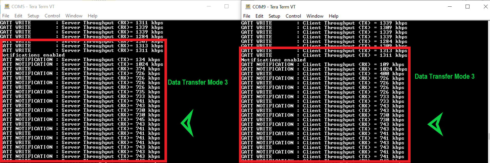

# CE226301- BLE Throughput Measurement

This code example demonstrates the maximum BLE throughput (using GATT layer notifications and writes) that can be obtained with Cypress Bluetooth devices (CYW208xx and CYW207xx) using ModusToolbox™ IDE.

This code example has two applications:
1. **BLE GATT Server Throughput Measurement**: This application sends GATT notifications and calculates the BLE TX throughput, and receives GATT Writes and calculates the BLE RX throughput.
2. **BLE GATT Client Throughput Measurement**: This application sends GATT writes and calculates the BLE TX throughput, and receives GATT notifications and calculates the BLE RX throughput.

**Note**: This code example can also be used with PSoC 6 BLE kits programmed with the [PSoC6 BLE throughput measurement code example](https://github.com/cypresssemiconductorco/mtb-example-psoc6-ble-throughput-freertos). The PSoC 6 BLE throughput measurement code example is similar to this code example. It has two apps: one for GATT Server and another for GATT Client.

## Requirements
- **Tool**: [ModusToolbox™ IDE](https://www.cypress.com/products/modustoolbox-software-environment) v 2.x
- **Programming Language**: C
- **Associated Parts**: [CYW20819](https://www.cypress.com/datasheet/CYW20819), [CYW20820](https://www.cypress.com/datasheet/CYW20820), [CYW20719](https://www.cypress.com/documentation/datasheets/cyw20719-enhanced-low-power-bredrble-bluetooth-50-soc)

## Supported Kits
- [CYW920819EVB-02 Evaluation Kit](http://www.cypress.com/CYW920819EVB-02)
- [CYW920820EVB-02 Evaluation kit](http://www.cypress.com/CYW920820EVB-02)
- [CYW920719B2Q40EVB-01 Evaluation kit](https://community.cypress.com/docs/DOC-17736)

## Hardware Setup
This example uses the board's default configuration. Refer to the kit user guide to ensure that the board is configured correctly.
Two boards are required to use this code example: one for BLE GATT Server throughput measurement and the other for BLE GATT Client throughput measurement.
A combination of CYW20819, CYW20820, or CYW20719 can be used. PSoC 6 BLE kits programmed with the [PSoC6 BLE throughput measurement code example](https://github.com/cypresssemiconductorco/mtb-example-psoc6-ble-throughput-freertos) can also be used.

## Software Setup
Install a terminal emulator if you don't have one. Instructions in this document use [Tera Term](https://ttssh2.osdn.jp/index.html.en). All other required software come bundled with the ModusToolbox IDE.

To use a Windows PC as the BLE Central device for the GATT Server Throughput Measurement application, install [CySmart Host Emulation Tool](https://www.cypress.com/documentation/software-and-drivers/cysmart-bluetooth-le-test-and-debug-tool). You will also need [CY5677 CySmart BLE 4.2 USB Dongle](http://www.cypress.com/documentation/development-kitsboards/cy5677-cysmart-bluetooth-low-energy-ble-42-usb-dongle).

To use an iOS or Android smartphone as the BLE Central device, download the CySmart app. Scan the following QR codes from your mobile phone to download the CySmart app.


**NOTE**: If you are using a Windows PC or iOS/Android smartphone as BLE Central, all features of the GATT Server throughput measurement application cannot be used. Throughput can be measured only for GATT notifications. In this case, throughput rates obtained will depend on the connection parameters negotiated and the PHY of the Central device.

## Using the Code Example

### In ModusToolbox IDE:
1. Install ModusToolbox 2.x.

2. In the ModusToolbox IDE, click the **New Application** link in the Quick Panel (or, use **File > New > ModusToolbox IDE Application**).

3. Select your board (CYW920819EVB-02/ CYW920820EVB-02/ CYW920719B2Q40EVB-01) and click **Next**.

4. Select **wiced\_btsdk**. This project contains the SDK. It is used by all BT-SDK applications. You will need to create this project just once in the working directory (i.e., Eclipse workspace). Ignore if you have already created this project.

    **Note**: Do not change the name of this project. All BT-SDK apps use this project name in application makefiles.

5. After the 'wiced\_btsdk' project is created, click the **New Application** link again, select the board, and click **Next**.

6. Select the **BLE_Throughput_Measurement** application and click **Next**. Click **Finish** to create the application. Two apps, *GATT_client* and *GATT_server*, are created in the workspace.

    **Note**: Both the applications are created for the board that you have selected in Step 3.

7. Select the *GATT_server* application in the IDE. In the Quick Panel, click the **Build** link to build the application.

8. Connect one board to your PC.

9. To program it (download the application), select **Program** in the Quick Panel.

    **Note**: If the download fails, it is possible that a previously loaded application is preventing programming. For example, the application may use a custom baud rate that the download process does not detect or the device may be in low-power mode. In that case, it may be necessary to put the board in recovery mode, and then try the programming operation again from the IDE. To enter recovery mode, first, press and hold the Recover button (SW1), press and release the Reset button (SW2), and then release the Recover button (SW1).

10. Unplug the board from PC.

11. Next, select the *GATT_client* application, and in the Quick Panel, select **Build** to build the application.

12. Connect the other board and select **Program** in the Quick Panel. After successfully programming the second app, plug in the first board which has the BLE GATT Server Throughput application.

### In Command-line Interface (CLI):

1. Install ModusToolbox 2.x.

2. In Windows, run Cygwin by clicking on the *Cygwin.bat* file from the  *<install_folder>\ModusToolbox\tools_2.x\modus-shell* folder. The default install folder is the user's home directory. All the following steps should be run from inside the Cygwin window.

3. Go to the directory that you want to use for your workspace. Use the `mkdir <directory>` command to create the new directory and run the `cd <directory>` command.

4. Clone the *wiced\_btsdk* repo first. As mentioned earlier, this project contains the SDK used by all apps. You will need to create this project just once in the working directory. For example:
   ```
   > git clone https://github.com/cypresssemiconductorco/wiced_btsdk
   ```
5. Clone the app repo *mtb-example-btsdk-ble-throughput*. The application repo directory should be at the same folder level as *wiced_btsdk*. For example:
   ```
   > git clone https://github.com/cypresssemiconductorco/mtb-example-btsdk-ble-throughput
   ```

6. The *wiced_btsdk* repo contains references to other repos. To download all the required collateral, navigate to the *wiced_btsdk* folder and use the `make getlibs` command. For example:
   ```
   > cd wiced_btsdk
   > make getlibs
   ```
7. Navigate into the *GATT_server* application folder from the *wiced_btsdk* folder. To build the application using the default target (CYW920819EVB-02), run the `make build` command:
   ```
   > cd ../mtb-example-btsdk-ble-throughput/GATT_server
   > make build
   ```
    To build the application with a different target (supported by the application), use the following command:
    ```
    > cd ../mtb-example-btsdk-ble-throughput/GATT_server
    > make build TARGET=<BSP>
    ```
    Example:
    ```
    > cd ../mtb-example-btsdk-ble-throughput/GATT_server
    > make build TARGET=CYW920820EVB-02
    ```
8. Connect the first board to your PC.

9. To program (download the application) the board, run the `make qprogram` (for default target - CYW920819EVB-02)
   ```
   > make qprogram
   ```
   If you have built the application for a different target, use the following command to program:
    ```
    > cd ../mtb-example-btsdk-ble-throughput/GATT_server
    > make qprogram TARGET=<BSP>
    ```
    Example:
    ```
    > cd ../mtb-example-btsdk-ble-throughput/GATT_server
    > make qprogram TARGET=CYW920820EVB-02
    ```
   **Note**: If the download fails, it is possible that a previously loaded application is preventing programming. For example,the application may use a custom baud rate that the download process does not detect or the device may be in low-power   mode. In that case, it may be necessary to put the board in recovery mode, and then try the programming operation again from the IDE. To enter recovery mode, first, press and hold the Recover button (SW1), press and release the Reset button (SW2), and then release the Recover button (SW1).

10. Unplug the board after programming.

11. Exit the *GATT_server* application and navigate to the *GATT_client* application folder:
    ```
    > cd ../GATT_client
    ```
12. Build the *GATT_client* application:
    ```
    > make build
    ```
13. Connect the other board and program it:
    ```
    > make qprogram
    ```

14. After successfully programming the BLE GATT Client application, plug in the first board.

15. To build and program the application to the board in a single step, run the `make program` command from respective application folder paths:
    ```
    > make program
    ```

    **Note**: `make program` = `make build` + `make qprogram`

## Operation

###	Using Two Boards:
1. Connect the two boards to your PC using the provided USB cable through the USB connector.

2. Open a terminal program and select the WICED PUART COM port. Set the serial port parameters to 8N1 and 115200 baud. You need two windows of the terminal application to view messages from the GATT Server device and the GATT Client device.

3. Program one board with the *GATT_server* application and the other with the *GATT_client* application.

4. After programming, the application starts automatically. The GATT server device will start advertising.

    ##### Figure 1. Terminal Output for GATT Server when It Is Advertising
      

5. Press SW3 on your GATT Client device to start scanning. The Client will check for peer devices with the name 'TPUT'. If it finds a device with this name, it will initiate the connection. Therefore, after pressing the button, kits will be automatically connected. After GATT connection, PHY, MTU and connection interval values are negotiated. LED 1 will turn ON after connection.

    ##### Figure 2. Terminal Output for GATT Client After Connection
      

    Now, you should be able to see throughput values (in kbps) on the terminal. After connection, the BLE GATT Client device will subscribe for notifications and the BLE GATT Server will start sending GATT notifications of 244 bytes. For every one second, throughput is calculated and displayed on the terminal. In this case, the BLE GATT Server will calculate the TX throughput, while the BLE GATT Client will calculate the RX throughput. LED 2 on the GATT Server will turn ON if there is data transfer.

    ##### Figure 3. Terminal Output: Data Transfer Mode 1
      

6. Press SW3 on the BLE GATT Client device. Notifications are disabled, and GATT write is enabled. LED 2 on the GATT Server device turns OFF. LED 2 on the GATT Client device turns ON if there is data transfer.

    ##### Figure 4. Terminal Output: Data Transfer Mode 2
      

7. Press SW3 again. Notifications are enabled, and GATT write will stay enabled. LED 2 on both boards will turn ON if there is data transfer.

    ##### Figure 5. Terminal Output: Data Transfer Mode 3
      

8. Press the button (SW3) again to keep notifications enabled but disable GATT write. Consecutive button presses will change the mode of data transfer as mentioned in steps 5, 6, and 7.

    **Note:** Switch Debounce is not handled in the application. In case of switch debounce, the next data transfer mode will be skipped.

9. If a disconnection occurs, the GATT Server device will start advertising again.

    **Note:** To see debug traces, enable the `VERBOSE_THROUHPUT_OUTPUT` macro in the application makefile.

### Using CySmart Desktop Application as BLE Central

1. Connect the board to your PC using the provided USB cable through the USB connector.

2. Open any serial terminal and select WICED PUART COM. Set the serial port parameters to 8N1 and 115200 baud.

3. Program the board with the BLE_Throughput_Measurement GATT_server application.

4. Open the [CySmart desktop application](https://www.cypress.com/documentation/software-and-drivers/cysmart-bluetooth-le-test-and-debug-tool) and connect to the [CySmart CY5677 dongle](http://www.cypress.com/cy5677) (Central device). See the [CySmart user guide](https://www.cypress.com/file/232316/download) to learn how to use the desktop application.

5. To measure TX GATT throughput of the board:

   1. Using the CySmart desktop application, **scan** and **connect** to the 'TPUT' device.

   2. If prompted, click **Yes** to update the connection parameters. See the [Connection Interval](#Factors-influencing-Throughput) section to understand how the connection interval affects the throughput. Once the connection is established, LED 1 will be ON.

   3. Go to the **Device** tab and click **Discover all attributes**.

   4. Click **Enable all Notifications**. The TX GATT throughput values (in kbps) will be displayed on the UART terminal. LED 2 will be ON while the device is sending notifications; it will be OFF intermittently indicating GATT packet congestion.

   5. Click **Disable All Notifications** to stop measuring the GATT throughput.

   6. Click **Disconnect** to disconnect from the Central device.

### Using CySmart iOS/Android App on Smartphone as BLE Central

1. Connect the board using the provided USB cable through the USB connector.

2. Open any serial terminal and select WICED PUART COM. Set the serial port parameters to 8N1 and 115200 baud.

3. Program the board with the BLE_Throughput_Measurement GATT_server application.

4. Turn ON Bluetooth on your Android or iOS device and launch the CySmart app.

5. Swipe down on the CySmart app home screen to start scanning for BLE Peripherals; your device appears in the CySmart app home screen with the name 'TPUT'`. Select your device to establish a BLE connection (see [Figure 6](#Figure-6-Screenshots-of-CySmart-App)). Once the connection is established, LED 1 will be ON.

6. Select **GATT DB** from the carousel view (see [Figure 6](#Figure-6-Screenshots-of-CySmart-App)). Swipe left or right to change carousel selections.

7. Select **Unknown Service** and then select the Characteristic with the **Notify** property.

8. Select **Notify** (see [Figure 6](#Figure-6-Screenshots-of-CySmart-App)). The device will start sending GATT notifications to the mobile. LED 2 will be ON while the device is sending notifications and will be OFF intermittently indicating GATT packet congestion.

    ##### Figure 6. CySmart App
    

    The TX GATT throughput values (in kbps) will be displayed on the UART terminal.

## Design and Implementation

### Introduction

#### GATT Throughput Measurement

In this code example, BLE throughput is measured using GATT data sent/received by the application. The application accumulates the *number of data packets sent/received*, and calculates the throughput each second.

GATT Throughput = (number of packets * number of bytes in each packet * 8 bits) bps

Or

GATT Throughput = (number of packets * number of bytes in each packet * 8 bits)/1000 kbps

While calculating the throughput, you need to consider only GATT data bytes. All the header bytes appended to GATT data must not be considered. [Figure 7](#Figure-7-GATT-Data-Flow) shows the data flow through LE protocol layers and headers being appended in each layer.

##### Figure 7. GATT Data Flow


To achieve maximum throughput:
* PHY is set to 2M
* ATT MTU is set to 247
* Connection interval of 26.25 msec is requested by the Peripheral
* Data Length Extension (DLE) is used
* The GATT data is 244 bytes

#### Factors Influencing Throughput

Some of the known factors that impact the data throughput are explained below.

1. **PHY**

    The PHY rate being used will have direct impact on the maximum data throughput. You can select either 1-Mbps or 2-Mbps PHY. In this code example, PHY is set to 2 Mbps (2M) after connection. If the BLE Central device does not support 2M PHY, the value falls back to 1 Mbps (1M). The PHY selected is printed on the UART terminal.

2. **Connection Interval**

    A BLE Connection Interval is the time between two data transfer events between the Central and the Peripheral device (in simple words, how often the devices talk). It ranges from 7.5 ms to 4 seconds (with increments of 1.25 ms). In a connection interval, there may be only one Tx/Rx pair, or, if the PDU has the More Data (MD) flag set, multiple packets may be sent in the same interval. A connection event is the time duration within the connection interval where there is actual Tx/Rx activity happening. The connection event is always less than the connection interval. A connection event will end 1 inter frame space (IFS) before connection interval. Therefore, the connection interval value chosen will impact the throughput.

    A BLE connection is established with the connection interval value set by the Central device. However, the Peripheral may request a different value. The Central device makes the final decision and chooses a value that may be different from, but closer to, the requested value. In this code example, the Peripheral device requests a connection interval value of 26.25 ms, but the value you get will depend on the Central device that you use. The connection interval differs between iOS and Android. It also changes depending on the version of the OS running on the device. This is because the BLE radio may have to attend to other events from the OS and the number of packets sent per connection event may not reach the maximum possible by the BLE stack.

    Note that the CySmart desktop application has an option to change the connection interval, but the CySmart mobile app doesn’t support that option. Refer to the *Configuring Master Settings* section on the [CySmart user guide](https://www.cypress.com/file/232316/download) for detailed instructions on connection parameters. Once a connection is established, the UART log will indicate the connection interval whenever it is changed.

3. **ATT Maximum Transmission Unit (MTU)**

    ATT MTU determines the maximum amount of data that can be handled by the transmitter and receiver as well as how much they can hold in their buffers. The minimum ATT MTU allowed is 23 bytes. This allows a maximum of 20 bytes of ATT payload (3 bytes are used for the ATT header). There is no limit on the maximum MTU value.

    If the ATT MTU is exactly 247 bytes, 244 bytes of ATT data will fit into a single packet. If the MTU is greater than 247 bytes, the data is split into multiple packets causing the throughput to go down because of increase in packet overhead and timing in between packets. Therefore, GATT data size chosen in the application is 244 bytes.

4. **Data Length Extension (DLE)**

    DLE allows the link layer packet to hold a larger payload up to 251 bytes ([Figure 8](#Figure-8.-LE-Packet-Format)). This means that for one TX/RX pair, 244 bytes of GATT data can be sent/received with DLE enabled. If the GATT data is larger than 244 bytes, it is split into multiple link layer (LL) packets to be transmitted. This introduces header bytes for every chunk of data and therefore results in lower throughput. BLE versions earlier than 4.2 support a maximum payload of 27 bytes.

    The Peripheral (CYW20819, CYW20719, and CYW20820 devices with BLE version 5.0) has DLE enabled by default. If the Central device has DLE enabled ( from BLE version 4.2 and above), it will get a higher throughput.

5. **Packet Overhead**

    ##### Figure 8. LE Packet Format

    

    As shown in [Figure 8](#Figure-8.-LE-Packet-Format), the LE packet includes many packet header bytes which get added up in each layer that are not accounted for in the application data throughput. To minimize the packet overhead, try to configure the ATT MTU size in such a way that at any time the ATT payload data will fit in a single LE packet. In this code example, the ATT MTU size used is 247 bytes, which exactly matches with the ATT payload data size of 244 bytes.

**BLE GATT Server Throughput Measurement**

In this code example, the kit acts as a BLE GAP Peripheral and GATT Server. When the kit is powered up, the BLE stack is initialized, a BLE event callback is registered, the GATT database is registered, and two timers are initialized. After this, advertisement data is set, and the kit starts advertising. The advertisement packet contains the name of the device 'TPUT' and Throughput Measurement Service UUID.  There is no timeout for advertisement.

A connection is established when any Client device sends a connection request. After connection, PHY is set to 2M and a request to update the connection interval is sent to the GAP Client. The PHY selected and new connection interval values are displayed on the terminal.

The GATT Server has a custom service called 'Throughput Measurement'. This service has two characteristics called 'Notify' and 'WriteMe'. The Notify characteristic has a Client Characteristic Configuration Descriptor
 (CCCD).

##### Figure 9. Throughput Measurement Custom Service


**Notify Characteristic:** This characteristic is used to send GATT notifications and has a length of 244 bytes. The bytes sent are used to calculate the TX throughput.

* When the GATT Client writes the value '1' into the CCCD, notifications are enabled, and the GATT Server starts sending notification packets which have 244 bytes of data. Notifications are sent every millisecond. A millisecond timer is configured and used for this purpose.

* When the GATT Client writes the value '0' into the CCCD, notifications are disabled, and the GATT Server stops sending notifications.

**WriteMe Characteristic:** This characteristic is used to receive GATT writes from a GATT Client device and has a length of 244 bytes. The bytes received are used to calculate the RX throughput.

Two timers are used in the application:
* One-second timer: To calculate the TX/RX throughput and send the values over UART to the serial terminal. Throughput values displayed have unit ‘kbps’.

* One-millisecond timer: To send GATT notifications.

Two LEDs are used in the application:

* LED1: ON when a GAP connection is established, OFF otherwise.

* LED2: ON when there is active data transmission. OFF when there is GATT congestion or when data transmission is disabled.

The application-level source files for this code example are listed in [Table 1](#Table-1-Application-Source-Files):

##### Table 1. Application Source Files

|**File Name**            |**Comments**      |
| ------------------------|---------------------------------------|
| *tput_server.c* | Has application entry function. It initializes the UART for debugging and then initializes the controller stack.|
| *tput_server_ble.c* | Handles BLE initialization, configuration, advertisement, notifications, and responses to BLE events. It also manages the timer callbacks and calculates throughput.|
| *app_bt_cfg.c* | Runtime Bluetooth stack configuration parameters|


**BLE GATT Client Throughput Measurement**

In this code example, the kit acts as a BLE GAP Central and GATT Client. When the kit is powered up, the BLE stack is initialized, a BLE event callback is registered, the GATT database is registered, two timers are initialized, and a button interrupt is registered. After this, the application waits for a button press by the user to start scanning.

If the Central device finds the peer device with the name 'TPUT', it sends a connection request. After the connection is established, the GATT Client subscribes for notification by writing into the CCCD of the 'Notify' characteristic. Once it starts receiving notifications, the packets are accumulated, and RX throughput is calculated every second. This is data transfer mode 1. In data transfer mode 2, The GATT Client disables notifications and starts sending GATT write command with 244 bytes of data in each packet. In this mode, TX throughput is calculated by accumulating successfully sent data bytes. In data transfer mode 3, GATT client enables notifications and continues sending GATT write commands. Both TX and RX throughput is calculated in mode 3.

Pressing the user button(SW3) switches between the three modes of data transfer listed below:
1. GATT notifications from Server to Client
2. GATT write from Client to Server
3. Both GATT notifications and GATT writes

##### Figure 10. Three Modes of Data Transfer


Two timers are used in the application:
* One-second timer: To calculate the TX/RX throughput and send values over UART to the serial terminal. The throughput values displayed have unit ‘kbps’.

* One-millisecond timer: To send GATT writes.

Two LEDs are used in the application:
* LED1: ON when a GAP connection is established, OFF otherwise.

* LED2: ON when there is active data transmission. OFF when there is GATT congestion or when data transmission is disabled.

The application-level source files for this code example are listed in [Table 2](#Table-2-Application-Source-Files):

##### Table 2. Application Source Files

|**File Name**            |**Comments**      |
| ------------------------|------------------|
| *tput_client.c* | Has application entry function. It initializes the UART for debugging and then initializes the controller stack.|
| *tput_client_ble.c* | Handles BLE initialization, configuration, and responses to BLE events. It also manages the timer and button interrupt callbacks and calculates throughput.|
| *app_bt_cfg.c*| Runtime Bluetooth stack configuration parameters|

**Application Flow Diagram**
##### Figure 11. Application Flowchart for BLE GATT Server and Client Devices


## Resources and Settings
This section explains the ModusToolbox resources and their configuration as used in this code example. Note that all the configuration explained in this section has already been done in the code example. The ModusToolbox IDE stores the configuration settings of the application in the *design.modus* file. This file is used by the graphical configurators, which generate the configuration firmware. This firmware is stored in the application’s *GeneratedSource* folder.

* **Device Configurator** The Device Configurator is used to enable/configure the peripherals and the pins used in the application. See the
[Device Configurator Guide](https://www.cypress.com/ModusToolboxDeviceConfig).

* **Bluetooth Configurator:** The Bluetooth Configurator is used for generating/modifying the BLE GATT database. See the
[Bluetooth Configurator Guide](https://www.cypress.com/ModusToolboxBLEConfig).

## Related Resources
| Application Notes||
|--|--|
| [AN225684](http://www.cypress.com/an225684):  Getting Started with CYW208xx | Describes CYW208xx device and how to build your first ModusToolbox project |
|**Code Examples**| Visit the [Cypress GitHub repo](https://www.cypress.com/mtb-github) for a comprehensive collection of code examples using ModusToolbox IDE|
|**Device Documentation**|
|[CYW20819 Device Datasheet](https://www.cypress.com/datasheet/CYW20819)|
|[CYW20820 Device Datasheet](https://www.cypress.com/datasheet/CYW20820)|
|[CYW20719 Device Datasheet](https://www.cypress.com/documentation/datasheets/cyw20719-enhanced-low-power-bredrble-bluetooth-50-soc)|
|**Development Kit Documentation**|
|[CYW920819EVB-02 Evaluation Kit](http://www.cypress.com/CYW920819EVB-02)|
|[CYW920820EVB-02 Evaluation Kit](http://www.cypress.com/CYW920820EVB-02)|
|[CYW920719B2Q40EVB-01 Evaluation kit](https://community.cypress.com/docs/DOC-17736)|
|**Tool Documentation**|
|[ModusToolbox IDE](http://www.cypress.com/modustoolbox)| The Cypress IDE for IoT designers|

--------------------------------------------------------------------------------------------
## Document History

Document Title: CE226301 - BLE Throughput Measurement

| Version | Description of Change |
| ------- | --------------------- |
| 1.0.0   | New code example      |

------


-------------------------------------------------------------------------------

© Cypress Semiconductor Corporation, 2020. This document is the property of Cypress Semiconductor Corporation and its subsidiaries (“Cypress”).  This document, including any software or firmware included or referenced in this document (“Software”), is owned by Cypress under the intellectual property laws and treaties of the United States and other countries worldwide.  Cypress reserves all rights under such laws and treaties and does not, except as specifically stated in this paragraph, grant any license under its patents, copyrights, trademarks, or other intellectual property rights.  If the Software is not accompanied by a license agreement and you do not otherwise have a written agreement with Cypress governing the use of the Software, then Cypress hereby grants you a personal, non-exclusive, nontransferable license (without the right to sublicense) (1) under its copyright rights in the Software (a) for Software provided in source code form, to modify and reproduce the Software solely for use with Cypress hardware products, only internally within your organization, and (b) to distribute the Software in binary code form externally to end users (either directly or indirectly through resellers and distributors), solely for use on Cypress hardware product units, and (2) under those claims of Cypress’s patents that are infringed by the Software (as provided by Cypress, unmodified) to make, use, distribute, and import the Software solely for use with Cypress hardware products.  Any other use, reproduction, modification, translation, or compilation of the Software is prohibited.
TO THE EXTENT PERMITTED BY APPLICABLE LAW, CYPRESS MAKES NO WARRANTY OF ANY KIND, EXPRESS OR IMPLIED, WITH REGARD TO THIS DOCUMENT OR ANY SOFTWARE OR ACCOMPANYING HARDWARE, INCLUDING, BUT NOT LIMITED TO, THE IMPLIED WARRANTIES OF MERCHANTABILITY AND FITNESS FOR A PARTICULAR PURPOSE.  No computing device can be absolutely secure.  Therefore, despite security measures implemented in Cypress hardware or software products, Cypress shall have no liability arising out of any security breach, such as unauthorized access to or use of a Cypress product.  CYPRESS DOES NOT REPRESENT, WARRANT, OR GUARANTEE THAT CYPRESS PRODUCTS, OR SYSTEMS CREATED USING CYPRESS PRODUCTS, WILL BE FREE FROM CORRUPTION, ATTACK, VIRUSES, INTERFERENCE, HACKING, DATA LOSS OR THEFT, OR OTHER SECURITY INTRUSION (collectively, “Security Breach”).  Cypress disclaims any liability relating to any Security Breach, and you shall and hereby do release Cypress from any claim, damage, or other liability arising from any Security Breach.  In addition, the products described in these materials may contain design defects or errors known as errata which may cause the product to deviate from published specifications.  To the extent permitted by applicable law, Cypress reserves the right to make changes to this document without further notice. Cypress does not assume any liability arising out of the application or use of any product or circuit described in this document.  Any information provided in this document, including any sample design information or programming code, is provided only for reference purposes.  It is the responsibility of the user of this document to properly design, program, and test the functionality and safety of any application made of this information and any resulting product.  “High-Risk Device” means any device or system whose failure could cause personal injury, death, or property damage.  Examples of High-Risk Devices are weapons, nuclear installations, surgical implants, and other medical devices.  “Critical Component” means any component of a High-Risk Device whose failure to perform can be reasonably expected to cause, directly or indirectly, the failure of the High-Risk Device, or to affect its safety or effectiveness.  Cypress is not liable, in whole or in part, and you shall and hereby do release Cypress from any claim, damage, or other liability arising from any use of a Cypress product as a Critical Component in a High-Risk Device.  You shall indemnify and hold Cypress, its directors, officers, employees, agents, affiliates, distributors, and assigns harmless from and against all claims, costs, damages, and expenses, arising out of any claim, including claims for product liability, personal injury or death, or property damage arising from any use of a Cypress product as a Critical Component in a High-Risk Device.  Cypress products are not intended or authorized for use as a Critical Component in any High-Risk Device except to the limited extent that (i) Cypress’s published data sheet for the product explicitly states Cypress has qualified the product for use in a specific High-Risk Device, or (ii) Cypress has given you advance written authorization to use the product as a Critical Component in the specific High-Risk Device and you have signed a separate indemnification agreement.
Cypress, the Cypress logo, Spansion, the Spansion logo, and combinations thereof, WICED, PSoC, CapSense, EZ-USB, F-RAM, and Traveo are trademarks or registered trademarks of Cypress in the United States and other countries. For a more complete list of Cypress trademarks, visit cypress.com.  Other names and brands may be claimed as property of their respective owners.
